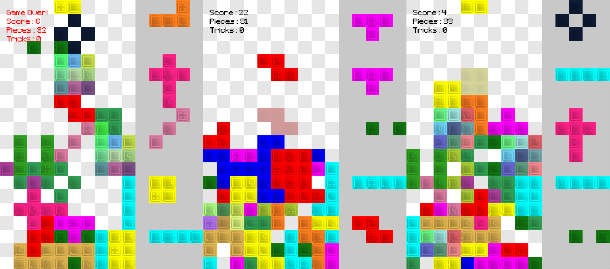
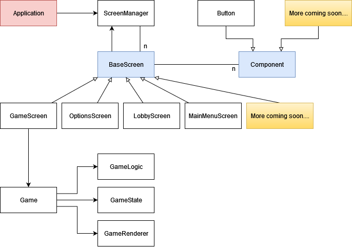

# Tetris Game

Welcome to the Tetris Game repository! Here you can find all the resources and code for playing and understanding how the Tetris game works.

## Download the Game

You can download the latest version of the Tetris game from the releases section. The current version available for download is **Tetris version 1**, which was released on January 4, 2024.

To download, please visit the [Releases](https://github.com/Hebelub/Tetris/releases) page of this repository, and select the latest version. There, you will find downloadable assets for the game. Simply click on the asset you wish to download, and the download will start automatically.

### Installing the Game

After downloading, unzip the file and run the executable file to start playing Tetris on your computer.

## Game Controls

In the Tetris game, players can control their pieces using the following key configurations. The controls for the Left, Center, and Right players perform the same actions but utilize different keys for each position.

| Action       | Left Player | Center Player | Right Player |
|--------------|-------------|---------------|--------------|
| Turn         | W           | I             | ↑            |
| Move Left    | A           | J             | ←            |
| Fall Fast    | S           | K             | ↓            |
| Move Right   | D           | L             | →            |
| Instant Drop | Left Ctrl   | Space         | Enter        |

Each player's controls are designed to provide an intuitive and comfortable gaming experience, allowing for quick reactions and strategic play. Ensure you're familiar with your player position's controls for the best gaming experience.

## Game Demo

Check out how the game looks:

## Project Architecture

To get a better understanding of the project's architecture, have a look at our UML diagram:

---

Enjoy the game, and feel free to contribute or report any issues you encounter!
